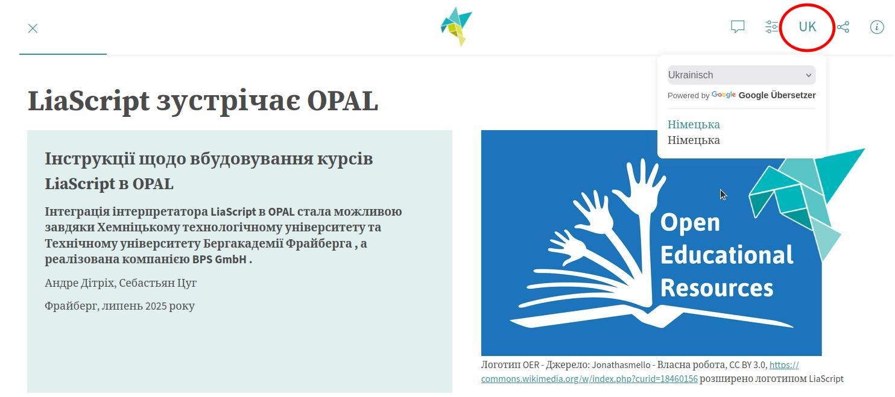
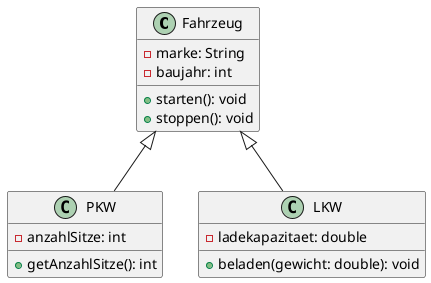

<!--
author:   Sebastian Zug, André Dietrich, Volker Göhler

email:    Volker.Goehler@informatik.tu-freiberg.de, Sebastian.Zug@informatik.tu-freiberg.de

version:  0.2.1

language: de

narrator: Deutsch Male

edit: true
date: 2026-05-05

mode:     Presentation

icon: img/TUBAF_Logo_blau.png

comment:  Einsatz von LiaScript in der Bildung — Dev Day 2026. Dieser Kurs ist gleichzeitig Präsentation und Anschauungsobjekt.

import:   https://raw.githubusercontent.com/LiaTemplates/LiveEdit-Embeddings/refs/tags/0.0.1/README.md
          https://raw.githubusercontent.com/liaTemplates/AVR8js/main/README.md
          https://raw.githubusercontent.com/LiaTemplates/plantUML/master/README.md
          https://raw.githubusercontent.com/LiaScript/CodeRunner/master/README.md
          https://raw.githubusercontent.com/liaScript/mermaid_template/master/README.md
          https://raw.githubusercontent.com/LiaTemplates/LiveEdit-Embeddings/refs/heads/main/README.md
          https://raw.githubusercontent.com/Ifi-DiAgnostiK-Project/LiaScript_ImageQuiz/refs/heads/main/README.md
          https://raw.githubusercontent.com/Ifi-DiAgnostiK-Project/LiaScript_DragAndDrop_Template/refs/heads/main/README.md

translation: Deutsch  translations/German.md

link:   https://raw.githubusercontent.com/vgoehler/LiaScript_CSS_Provider/refs/heads/main/dist/university.css

-->

[](https://liascript.github.io/course/?https://raw.githubusercontent.com/vgoehler/Dev_Day_2026/refs/heads/main/lia_tutorial.md)

# Docs die Lehren 

LiaScript als entwicklungs- und verbreitungsfreundliches Format für interaktive Kurse
====================

**Was wäre, wenn ein Kurs wie ein Open-Source-Projekt funktioniert? Dieser Vortrag zeigt, wie wir mit Markdown, GitHub, LiaScript und Open Educational Resources Slides in interaktive Programmierkurse verwandeln.**

<section class="flex-container">

<!-- class="flex-child" style="min-width: 250px;" -->
> **Herzlich Willkommen!**<!-- class="head" -->
>
> Talk zum Dev Day 2026, Dresden, 5. Mai 2026<!-- class="subhead" -->

<!-- class="flex-child" style="min-width: 250px;" -->
 erweitert um LiaScript Logo")

</section>

--------------------------------------------

<section class="flex-container">
<!-- class="flex-child" style="min-width: 250px;" -->
_Die vollständige Präsentation — Präsentation, Demos, Quizze — ist ein einziges Textdokument. Den Quellcode finden Sie unter:_ [https://github.com/vgoehler/Dev_Day_2026](https://github.com/vgoehler/Dev_Day_2026)<!-- style="font-size: 20pt;"-->

<!-- class="flex-child" style="min-width: 250px;" -->
[qr-code]((https://github.com/vgoehler/Dev_Day_2026)
</section>

## Akteure und Ziele

Wer sind wir?
=====================

- __Volker Göhler__ (TU Bergakademie Freiberg, Institut für Informatik)
+ __Prof. Dr. Sebastian Zug__ (TU Bergakademie Freiberg, Institut für Informatik)
+ __Dr. André Dietrich__ (TU Bergakademie Freiberg, Institut für Informatik)
+ __Internationale LiaScript Community__ :-)

Was wollen wir heute erreichen?
====================

1. Sie verstehen, was LiaScript ist und wie es funktioniert
2. Sie können einen einfachen interaktiven Kurs erstellen
3. Sie wissen, wie Sie Ihren Kurs verbreiten können
4. Sie sehen, wie LiaScript zum OER-Gedanken passt

## LiaScript Kernkonzepte oder Was macht LiaScript besonders?

LiaScript wird als __Beschreibungssprache__ für __interaktive Lehr-Lern-Inhalte__ seid 2017 an der TU Bergakademie Freiberg entwickelt. Die Idee ist es, Lehrinhalte in einem Format zu beschreiben, das einfach durch den Browser interpretiert werden kann, in LMS integrierbar ist und gleichzeitig die Vorteile von __OER (Open Educational Resources)__ adressiert. 

Daraus resulieren vier Kernkonzepte:

> __1. Wir trennen Darstellung und Inhalt! Alle Elemente werden soweit wie möglich durch eine rein textuelle Repräsentation ausgedrückt.__

                        {{1-2}}
*******************************************************

Die Inhalte eines Textdokuments, das Elemente der Beschreibungssprache Markdown aufgreift, wandelt der Browser für den Lernenden in eine entsprechende Darstellung um.

``` markdown @embed.style(height: 500px; width: 100%)
# Hello World

> Das ist ein Text mit unterschiedlichen Formatierungen. __Fett__, _kursiv_ oder ~durchgestrichen~.
> 
> Hier folgt nun etwas Mathematik $f(x) = x^2$ und eine Aufzählung 
> 
> + Punkt 1
> + Punkt 2
> 
>    + Unterpunkt 2a
```

<!-- class="reference colorbox--orange" -->
> Das machen Markdown, Latex und HTML auch ... wo ist der Vorteil von LiaScript?


*******************************************************

> __2. Lehre lebt von Interaktion!__

                        {{2-3}}
*******************************************************

Ändern Sie die Sortierreihenfolge innerhalb der Tabelle, illustrieren Sie die Aussage anhand des intelligenten Diagrammgenerator (Button "Line Chart") und lösen Sie das Quiz.


``` markdown @embed.style(height: 500px; width: 100%)
# Tabellen als Grafiken

| X | B(y) | C(y) |
|---|:----:|:----:|
| 1 |   2  |   3  |
| 4 |   5  |   6  |

Quizze
------

Wann wurde die TU Bergakademie gegründet?

- [(X)] 1765
- [( )] 1896
```

*******************************************************

> __3. Der Browser kann viel mehr als Webseiten anzuzeigen.__


                        {{3-4}}
*******************************************************

In den vergangen Jahren entstanden aus der LiaScript-Community heraus verschiedene JavaScript-Plugins aus unterschiedlichen Wissensbereichen, die spezifische Inhalte interaktiv aufbereiten. Führen Sie die ABC Noten Notation aus - der Browser wird interpretiert und die Noten werden als Musikstück abgespielt.

```` markdown @embed.style(height: 500px; width: 100%)
<!--
import:   https://raw.githubusercontent.com/liaTemplates/ABCjs/main/README.md
-->

# Programmieren mit Musik

``` abc
X:353
T: GLUECK AUF DER STEIGER KOEMMT
N: E1512
O: Europa, Mitteleuropa, Deutschland
R: Staende -, Bergmanns - Lied
M: 4/4
L: 1/16
K: G
| G8F4A4 | G8z8 | B8A4c4 | B8z4G2A2 | B4B4B4A2B2 | c4A3AA4
A2B2 | c4c4c4B2c2 | d4B3BB4A4 | G8F8 | G4e4d4c2A2 | B8A8 | G8z8
```
@ABCJS.eval
````


*******************************************************

> __4. Vorlesungen als OER kollaborativ entwickeln.__

                        {{4-5}}
*******************************************************

Durch die Trennung von Inhalt und Darstellung können Lernende in die Entwicklung von Lehrinhalten eingebunden werden. Dies motiviert Studierende zusätzlich und förder die Identifikation mit der Lehrveranstaltung.

Das Video zeigt die Zusammenarbeit verschiedener Lehrender und Lernender im Kontext der Infomatiklehre in Freiberg über mehrere Jahre. 

!?[Video Studierende](./img/Student_as_Coauthors.mp4)<!--autoplay="true"-->

*******************************************************

## Beispielfeatures

<!-- class="reference" -->
> Aktivieren Sie die automatische Übersetzung der Inhalte, um Lernende aus anderen Ländern zu unterstützen. Die Implementierung nutzt die Google Übersetzungs-API und evaluiert sorgfältig, welche Inhalte zu überführen sind - Webseiten, Eigennamen, Formeln bleiben unverändert.



### Quizze

<!-- class="reference" -->
> LiaScript unterstützt eine Vielzahl von Quizformaten (Lückentext, Multiple-Choise, Drag&Drop, Rechenaufgaben). Diese können neben der eigentlichen Fragestellung mit zusätzlichen Informationen versehen werden, die den Lernenden helfen, die Frage zu beantworten.

Das kleine Beispiel reagiert noch nicht intelligent - die Hinweise sind statisch konfiguriert. In der Praxis können diese Hinweise aber dynamisch generiert werden, um den Lernenden zu helfen, die Frage gezielt zu beantworten.

__Beispiel für mathematische Aufgabe__

 Was ist das Ergebnis von $37 + 15$?

[[52]]
[[?]] Die Lösung ist größer als 50.
[[?]] Die Lösung ist kleiner als 55.
[[?]] Es solte eine gerade Zahl sein.
***********************************************************************

52 is the correct solution, you get this by adding:

``` ascii
                        .------.
                        |      |
                        |      v
                        |
                        |     (1)
  37           3(7)     |     (3)x          37
+ 15         + 1(5)     |   + (1)x        + 15
---- -->     ------ --> |   ------ -->    ----
  ??           (12)     |     (5)2          52
                |       |                 ====
                '-------'
                  carry
```

***********************************************************************


Testen Sie Ihr Wissen — die Antworten werden direkt im Browser ausgewertet:

Welche Programmiersprache ist _keine_ objektorientierte Sprache?

- [( )] Java
- [( )] Python
- [(X)] C
- [( )] C++
***

C ist eine prozedurale Programmiersprache. Objektorientierte Konzepte wie Klassen und Vererbung wurden erst mit C++ eingeführt.

***

---

Ordnen Sie die Begriffe richtig zu:

- [[Compiler]    [Interpreter]  [Assembler]]
- [    [X]           [ ]           [ ]     ]  Übersetzt gesamten Quellcode vor der Ausführung
- [    [ ]           [X]           [ ]     ]  Führt Quellcode Zeile für Zeile aus
- [    [ ]           [ ]           [X]     ]  Übersetzt Assemblersprache in Maschinencode


__Beispiel für einen Lückentext__

I (learn) [[  have been learning  ]] English for seven years now.
But last year I (not / work) [[ was not working ]] hard enough for English,
that's why my marks (not / be) _[[ were not ]]_ really that good then.
As I (pass / want) [[ want to pass ]] my English exam successfully next year,
I (study) ~[[ am going to study ]]~ harder this term.


#### Drag and Drop Quiz
<!--
@basepath: https://raw.githubusercontent.com/wenik35/LiaScript_ImageQuiz/main/img
mustang: @basepath/mustang.jpg
@f18: @basepath/f18.jpg
@chevrolet: @basepath/chevrolet.jpg
@ford: @basepath/ford.jpg
-->

> hint: cars are cool, but planes are cooler!

@dragdropmultiple(@uid, @mustang|@f18, @chevrolet|@ford)

Die Beschreibung aller Aufgabenformate findet sich in der Dokumentation im Abschnitte [Quiz Types](https://liascript.github.io/course/?https://raw.githubusercontent.com/liaScript/docs/master/README.md#68). 

### 3D Visualisierungen / Simulationen 

<!-- class="reference" -->
> LiaScript unterstützt die Einbettung von 3D-Modelle oder Simulationen zu integrieren, die aus unterschiedlichen Quellen stammen können. Die Modelle können interaktiv im Browser betrachtet werden und bieten eine Vielzahl von Möglichkeiten, komplexe Konzepte zu veranschaulichen.

??[Familienschacht](https://sketchfab.com/3d-models/familienschacht-freiberg-germany-7c7d30506c554385a4a4321366e2e601 "sketchfab.com https://sketchfab.com/3d-models/familienschacht-freiberg-germany - https://sketchfab.com/3d-models/familienschacht-freiberg-germany")

### Programmierumgebungen 

<!-- class="reference" -->
> Ihr Browser unterstützt nativ die Ausführung von JavaScript Code. LiaScript erweitert mit einem Coderunner-Server diese Möglichkeit auf aktuell 38 Programmiersprachen. Die Ausführung erfolgt serverseitig und die Ergebnisse werden im Browser angezeigt.

Führen Sie den Code mit dem kleinen Symbol unter dem Beispiel aus ... oha, es gibt einen Fehler. Korrigeren Sie den Code!

```python     BuggyCode.py
print("Geben Sie die Anzahl der Iterationen an:")
iterations = input()
for i in range(iterations):
    print("Hallo Welt", i)
```
@LIA.python3


> Seit Juli 2025 können LiaScript-Kurse direkt in OPAL importiert werden. Dies wurde durch eine Kooperation der TU Bergakademie und der TU Chemnitz sowie der BPS GmbH ermöglicht. [Blogbeitrag](https://blog.hrz.tu-chemnitz.de/urzcommunity/2025/07/08/neu-im-opal-mit-liascript-schnell-zum-anschaulichen-interaktiven-kurs/)


## Weitere Integrationen

Eine Vielfalt von Integrationen ermöglicht die Einbettung von Inhalten aus unterschiedlichen Quellen, wie z.B. PlantUML, ABC Notation, AVR8js, Mermaid, ... Diese können entweder direkt im Kurs angezeigt oder als editierbare Codeblöcke eingebunden werden.

### PlantUML Diagramm

> **Aufgabe:** Fügen Sie eine Klasse `Motorrad` hinzu, die von `Fahrzeug` erbt!


@plantUML.eval(png)

> **Hinweis:** Dieses Beispiel basiert auf der [PlantUML Integration](https://github.com/LiaScript/PlantUML), die die Erstellung und Ausführung von PlantUML-Diagrammen direkt im Browser ermöglicht. Der Code kann wie hier gezeigt, veränderbar sein oder unsichtbar bleiben.

### Arduino Simulation

> **Aufgabe:** Ändern Sie die Blinkfrequenz eines simulierten Arduino UNO auf 500ms!

<div>
  <wokwi-led color="red" pin="13" port="B" label="13"></wokwi-led>
  <span id="simulation-time"></span>
</div>
```cpp       arduino.cpp
// einmaliges Ausführen
void setup() {
  pinMode(13, OUTPUT);
}

// Endlosschleife
void loop() {
  digitalWrite(13, HIGH);
  delay(1000);
  digitalWrite(13, LOW);
  delay(1000);
}
```
@AVR8js.sketch

> **Hinweis:** Das Beispiel basiert auf der [AVR8js Simulation](https://github.com/LiaTemplates/AVR8js), die die Ausführung von Arduino-Sketches direkt im Browser ermöglicht. Der Code wird extern kompiliert und die CPU-Simulation läuft lokal.

### Python Beispiel

> **Aufgabe:** Erweitern Sie das Programm auf 20 Fibonacci-Zahlen!

```python
def fibonacci(n):
    """Berechnet die ersten n Fibonacci-Zahlen"""
    folge = [0, 1]
    for i in range(2, n):
        folge.append(folge[i-1] + folge[i-2])
    return folge

# Berechne die ersten 10 Fibonacci-Zahlen
ergebnis = fibonacci(10)
print("Fibonacci-Folge:", ergebnis)

# Visualisierung als einfaches Balkendiagramm
for i, zahl in enumerate(ergebnis):
    balken = "█" * (zahl + 1)
    print(f"F({i:2d}) = {zahl:4d} | {balken}")
```
@LIA.python3

> **Hinweis:** Dieses Beispiel basiert auf dem [CodeRunner Template](https://github.com/LiaScript/CodeRunner), das die Ausführung von gegenwärtig 30 Programmiersprachen ermöglicht. Der Code wird auf einem Server der TUBAF kompliert und ausgeführt bzw. interpretiert und das Ergebnis zurückgegeben. Das Repo umfasst das gesamte Image, um den CodeRunner auch lokal betreiben zu können.

## Verbreitung der Kurse

Sie haben unterschiedliche Möglichkeiten den Kurs zu verbreiten:

+ über Github oder einen anderen Git-Server indem Sie den Quellcode des Kurses veröffentlichen und einen Link darauf an Ihre Lernenden weitergeben
+ über eine Data-URI, die den gesamten Inhalt in einer URL kodiert (so können aber keine Bilder oder Dateien unmittelbar eingebunden werden)
+ über SCORM Pakete, die Sie in OPAL und andere LMS intrieren können. Aktuell setzt dies noch die Verwendung eines Kommandozeilentools voraus. Die Community bemüht sich gegenwärtig darum dieses in einen webbasierten Service zu überführen.
+ über die LiaScript-Integration in OPAL, die es ermöglicht, LiaScript-Kurse direkt in OPAL einzubetten und zu nutzen.

> __Ein Dokument — überall einsetzbar!__

<!--
style="width: 100%; max-width: 860px; display: block; margin-left: auto; margin-right: auto;"
-->
```ascii
+------------------+
| # Digital Systems|\                                      .-----------.
| (SoSe 2021)      +-+                              ╔══════|   Nativ   |══════╗
|                    |  --------------------------> ║      '-----------'      ║
| Task 1             |                              ║ Digital Systems 2021    ║
|                    |                              ║                         ║
| + Implement ...    | --------------+              ║ import numpy as np      ║
|                    |    Trans-     |              ║ ...                     ║
|                    |    formation  |              ╚═════════════════════════╝
+--------------------+               v
                                .-,(   ),-.                .-----------.
Lizenz: ...                  .-(           )-.      ╔══════|   LMS  Y  |══════╗
Inhalt: ...                 (    Exporter     )     ║      '-----------'      ║
Autor: ...                   '-(           )-'  +-->║ Digital Systems 2021    ║
Versionshistorie: ...           '-.(   ).-'     |   ║                         ║
                                     |          |
                                     +----------+          .-----------.
                                                |   ╔══════|  Webapp   |══════╗
                                                |   ║      '-----------'      ║
                                                +-->║ Digital Systems 2021    ║
                                                    ║                         ║                                     .
```

## Warum LiaScript? — Der OER-Gedanke

> __Open Educational Resources (OER)__ beschreibt die gemeinsame Entwicklung, Nutzung und Verbreitung von Lehr- und Lernmaterialien unter offener Lizenz.

                        {{0-1}}
*******************************************************

| Anforderung    | Bedeutung                                  |                              LiaScript                               |
| -------------- | ------------------------------------------ | :------------------------------------------------------------------: |
| `verwahren`    | Download, Speicherung und Vervielfältigung |         ressourceneffizient und ohne Softwarevoraussetzungen         |
| `verwenden`    | Nutzung im Lernkontext                     | native Nutzung im Browser oder eingebettet im Lern-Management-System |
| `verarbeiten`  | Umgestaltung und Adaption                  |    Bearbeitung des Textdokumentes entsprechend den Lizenzvorgaben    |
| `vermischen`   | Kombination und Extraktion                 |                  Kopieroperationen von Textinhalten                  |
| `verbreiten`   | (digitale) Publikation                     |                    im Webspace oder als Download                     |
| `VERSIONIEREN` | (digitale) Publikation                     |                            z.B. über Git                             |

*_5 V-Freiheiten für Offenheit_ nach Jöran Muuß-Merholz und Jörg Lohrer*

*******************************************************

                        {{1-2}}
*******************************************************

```ascii

      Wunsch nach                                             Wunsch nach
  einfacher Umsetzung  -----------> Konflikt <----------- spezifischen Elementen
                                       |                       im Material
                                       |
                                       v
                              OER als Lösungsansatz
                                       |
                                       v
                          LiaScript: Text + Interaktion
                                                                                    .
```

> LiaScript löst diesen Konflikt: Einfacher Text als Grundlage, aber mit voller Interaktivität.

*******************************************************

## Zusammenfassung

Was haben wir heute gesehen?
============================

{{0-1}}
| Thema                | Erkenntnis                                            |
| -------------------- | ----------------------------------------------------- |
| __Interaktivität__   | Quizze, Diagramme, Code-Ausführung — alles im Browser |
| __Einfachheit__      | Nur Text — kein spezielles Tool nötig                 |
| __OER-tauglich__     | Versionierung, Zusammenarbeit, offene Lizenz          |
| __OPAL-Integration__ | Direkter Import von GitHub ins LMS                 |

{{1}}
*******************************************************

> __Dieser gesamte Workshop war ein einziges Textdokument.__
>
> Den Quellcode zu diesem Kurs finden Sie auf [GitHub](https://github.com/SebastianZug/Saechsischer_Schulinformatik_Tag_2026).

Weiterführende Links:

- [LiaScript Projektwebseite](https://liascript.github.io/)
- [LiaScript Dokumentation](https://liascript.github.io/course/?https://raw.githubusercontent.com/liaScript/docs/master/README.md#1)
- [YouTube-Channel](https://www.youtube.com/channel/UCyiTe2GkW_u05HSdvUblGYg)
- [LiveEditor](https://liascript.github.io/LiveEditor/)
- [OPAL-LiaScript Blogbeitrag](https://blog.hrz.tu-chemnitz.de/urzcommunity/2025/07/08/neu-im-opal-mit-liascript-schnell-zum-anschaulichen-interaktiven-kurs/) vergleichbares vorgehen in OPAL-Schule

*******************************************************
